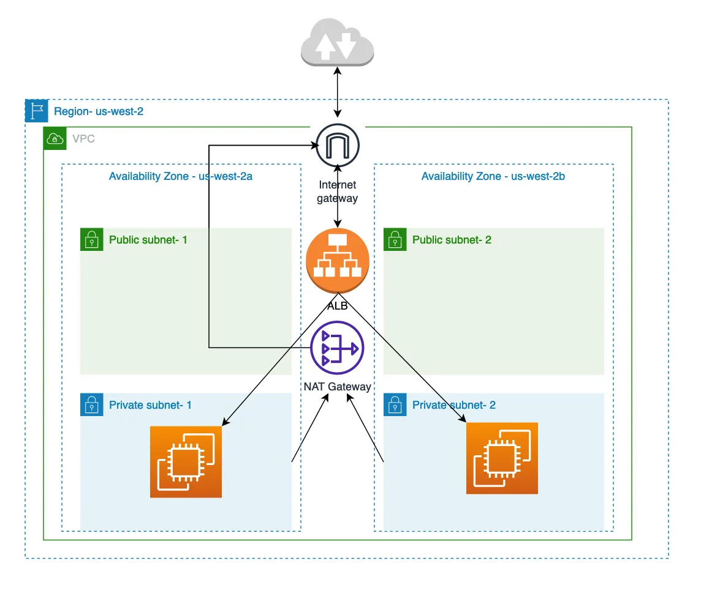

# Terraform Project - Module Version

This project sets up a secure infrastructure on AWS using Terraform. It includes the creation of a VPC, security groups, EC2 instances, and an Application Load Balancer (ALB).

## Directory Structure

```
Vertex-Phase-3-Module/
├── alb/
│   ├── main.tf
│   ├── outputs.tf
│   └── variables.tf
├── ec2/
│   ├── main.tf
│   ├── outputs.tf
│   └── variables.tf
├── security/
│   ├── main.tf
│   ├── outputs.tf
│   └── variables.tf
├── vpc/
│   ├── main.tf
│   ├── outputs.tf
│   └── variables.tf
├── main.tf
└── README.md
```

## Modules

- **VPC Module**: Creates a VPC with public and private subnets.
- **Security Module**: Creates security groups for EC2 instances and ALB.
- **EC2 Module**: Launches EC2 instances within the VPC.
- **ALB Module**: Sets up an Application Load Balancer with listeners and target groups.

## Diagram




## Usage

To set up your environment, export your AWS credentials as environment variables:

```sh
export AWS_ACCESS_KEY_ID="your_access_key"
export AWS_SECRET_ACCESS_KEY="your_secret_key"
# Optional
export AWS_SESSION_TOKEN="your_session_token"
```


1. Initialize the Terraform configuration:
   ```sh
   terraform init
   ```

2. Plan the infrastructure changes:
   ```sh
   terraform plan
   ```

3. Apply the infrastructure changes:
   ```sh
   terraform apply
   ```

## Outputs

- **VPC Module**: VPC ID, subnet IDs, and CIDR blocks.
- **Security Module**: Security group IDs for EC2 and ALB.
- **EC2 Module**: Private IP addresses and instance details.
- **ALB Module**: ALB ID, ARN, and DNS name.

## Requirements

| Name | Version |
|------|---------|
| <a name="requirement_aws"></a> [aws](#requirement\_aws) | ~> 5.0 |

## Providers

| Name | Version |
|------|---------|
| <a name="provider_aws"></a> [aws](#provider\_aws) | 5.84.0 |

## Modules

| Name | Source | Version |
|------|--------|---------|
| <a name="module_alb"></a> [alb](#module\_alb) | ./alb | n/a |
| <a name="module_ec2"></a> [ec2](#module\_ec2) | ./ec2 | n/a |
| <a name="module_security"></a> [security](#module\_security) | ./security | n/a |
| <a name="module_vpc"></a> [vpc](#module\_vpc) | ./vpc | n/a |

## Resources

| Name | Type |
|------|------|
| [aws_security_group.default](https://registry.terraform.io/providers/hashicorp/aws/latest/docs/data-sources/security_group) | data source |

## Inputs

| Name | Description | Type | Default | Required |
|------|-------------|------|---------|:--------:|
| <a name="input_availability_zones"></a> [availability\_zones](#input\_availability\_zones) | List of availability zones | `list(string)` | <pre>[<br/>  "us-east-1a",<br/>  "us-east-1b"<br/>]</pre> | no |
| <a name="input_aws_region"></a> [aws\_region](#input\_aws\_region) | AWS region | `string` | `"us-east-1"` | no |
| <a name="input_linux_distro"></a> [linux\_distro](#input\_linux\_distro) | Linux distribution for the EC2 instance | `string` | `"ubuntu"` | no |
| <a name="input_private_subnet_cidrs"></a> [private\_subnet\_cidrs](#input\_private\_subnet\_cidrs) | Map of private subnet CIDRs with their names | `map(string)` | <pre>{<br/>  "private_subnet_1": "10.0.3.0/24",<br/>  "private_subnet_2": "10.0.4.0/24"<br/>}</pre> | no |
| <a name="input_project_tag"></a> [project\_tag](#input\_project\_tag) | Tags for the project | `map(string)` | <pre>{<br/>  "Owner": "Aleksandre_Mikashavidze",<br/>  "Project": "epam-tf-lab",<br/>  "Terraform": "true"<br/>}</pre> | no |
| <a name="input_public_subnet_cidrs"></a> [public\_subnet\_cidrs](#input\_public\_subnet\_cidrs) | Map of public subnet CIDRs with their names | `map(string)` | <pre>{<br/>  "public_subnet_1": "10.0.1.0/24",<br/>  "public_subnet_2": "10.0.2.0/24"<br/>}</pre> | no |
| <a name="input_vpc_cidr"></a> [vpc\_cidr](#input\_vpc\_cidr) | CIDR block for the VPC | `string` | `"10.0.0.0/16"` | no |

## Outputs

| Name | Description |
|------|-------------|
| <a name="output_alb_dns_name"></a> [alb\_dns\_name](#output\_alb\_dns\_name) | The DNS name of the Application Load Balancer |
| <a name="output_availability_zones"></a> [availability\_zones](#output\_availability\_zones) | The availability zones of the VPC |
| <a name="output_ec2_private_ips"></a> [ec2\_private\_ips](#output\_ec2\_private\_ips) | The private IP addresses of the EC2 instances |
| <a name="output_private_subnet_cidrs"></a> [private\_subnet\_cidrs](#output\_private\_subnet\_cidrs) | The CIDR blocks of the private subnets |
| <a name="output_public_subnet_cidrs"></a> [public\_subnet\_cidrs](#output\_public\_subnet\_cidrs) | The CIDR blocks of the public subnets |
